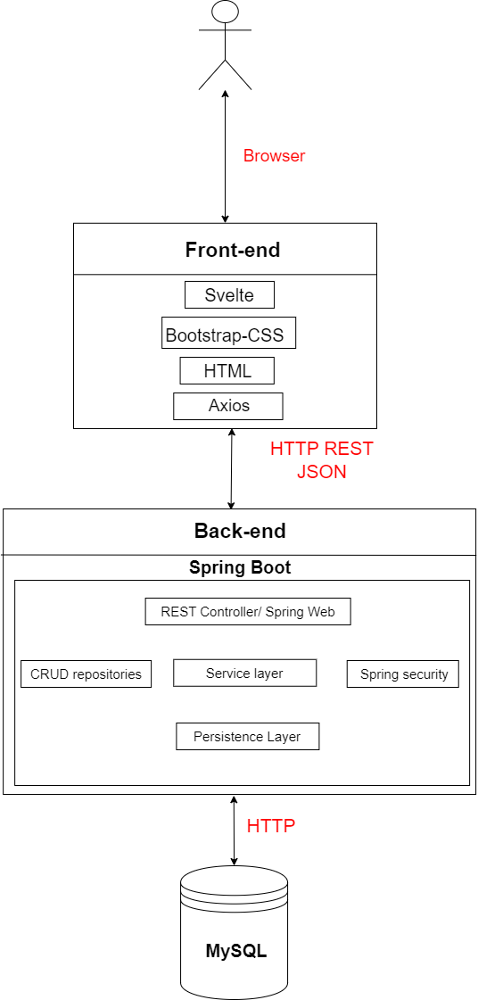

### The Forum app is a web app where users can create their own posts. Each user is also able to view other posts and write comments on them. Every user profile is public and its details( first and last name,workplace etc.) can be retrieved by others. The purpose of the Forum app is to create a place where anybody can ask and discuss questions with people in their related field of work.

## Home

### GET /api/ : Get home page

## Users

### GET /api/users: Retrieve all users

### GET /api/users/{userId}: Get user details (authentication required)

**Request payload**

~~~
Authorization: Bearer <token>
~~~

**Response payload**

### Successfully retrieved user information

~~~
HTTP/2 200 OK
Content-Type: application/json
Server: tomcat/10.1.16
{
  "username": "user_username",
  "first-name": "user_name",
  "second-name": "user_surname",
  "work-experience": "work_experience",
  "email": "user_email",
  "created_at": "date_of_creation"
} 
~~~

### Not authorized to view user details

~~~
HTTP/2 401 Unauthorized
Content-Type: application/json
{
  "error": {
    "code": 401,
    "message": "You are not authorized to view this user's information",
    "details": "Insufficient permissions or authentication required"
  }
}
~~~

### User not found

~~~
HTTP/2 404 Not Found
Content-Type: application/json
{
  "error": {
    "code": 404,
    "message": "User not found",
    "details": "The requested user does not exist"
  }
}
~~~

### POST /api/users: Create a new user

**Request payload**

~~~
Content-Type: application/json
{
    "username": "new_username",
    "first-name": "my_name",
    "second-name": "my_surname",
    "work-experience": "work_experience",
    "email": "new_email@example.com",
    "password": "new_password",
}
~~~

**Response payload**

### Successfully created new user

~~~
HTTP/2 201 Created
Content-Type: application/json
Server: tomcat/10.1.16
Cache-Control: no-cache
{
  "token": "auth_token",
  "user": {
  "userid": "user_id"
  "username": "user_username",
  "first-name": "user_name",
  "second-name": "user_surname",
  "work-experience": "work_experience",
  "email": "user_email",
  "created_at": "date_of_creation"
  }
}
~~~

### User with given email already exists

~~~
HTTP/2 409 Conflict
Content-Type: application/json
{
  "error": {
    "code": 409,
    "message": "User with the provided email already exists",
    "details": {
      "email": "user@example.com"
    }
  }
}
~~~

### Internal server error

~~~
HTTP/2 500 Internal Server Error
Content-Type: application/json
{
  "error": {
    "code": 500,
    "message": "Internal Server Error",
    "details": "An unexpected error occurred on the server while processing the request"
  }
}
~~~

### PATCH /api/users/{userId}: Update user information (authentication required)

**Payload**

~~~
Content-Type: application/json
Authorization: Bearer <token>
{
    "username": "new_username",
    "first-name": "my_name",
    "second-name": "my_surname",
    "work-experience": "work_experience",
    "email": "new_email@example.com",
    "password": "new_password",
}
~~~

### POST /api/login: Login into an existing user account

**Request payload**

~~~
Content-Type: application/json
{
    "email": "new_email@example.com"
    "password": "new_password",
}
~~~

**Response payload**

### Successfully logged into user account

~~~
HTTP/2 200 OK
Content-Type: application/json
{
  "token": "auth_token",
  "user": {
    "userId": "123456789",
    "username": "username",
    "first-name": "name",
    "second-name": "surname",
    "work-experience": "work_experience",
    "email": "email@example.com",
    "created_at": "date_of_creation"
  }
}
~~~

### User not found

~~~
HTTP/2 404 Not Found
Content-Type: application/json
{
  "error": {
    "code": 404,
    "message": "User not found",
    "details": "The requested user does not exist"
  }
}
~~~

### POST /api/logout : Log out of user account (authentication required)

**Payload**

~~~
Authorization: Bearer <token>
~~~

### DELETE /api/users/{userId}: Delete a user (authentication required)

**Payload**

~~~
Authorization: Bearer <token>
~~~

## Posts

### GET /api/posts?page=0&size=5: Retrieve posts

### GET /api/posts/{postId}: Retrieve a specific post by id

### GET /api/posts/{postTitle}: Retrieve a specific post by title

### POST /api/posts: Create a new post (authentication required)

**Payload**

~~~
Content-Type: application/json
Authorization: Bearer <token>
{
    "title": "Post Title",
    "content": "Post Content"
}
~~~

### PATCH /api/posts/{postId}: Update a specific post (authentication required)

**Payload**

~~~
Content-Type: application/json
Authorization: Bearer <token>
{
    "title": "Post Title",
    "content": "Post Content"
}
~~~

### GET /api/posts/{postId}/comments?page=0&size=10: Retrieve comments for a specific post

### DELETE /api/posts/{postId}: Delete a specific post (authentication required)

**Payload**

~~~
Authorization: Bearer <token>
~~~

## Comments

### POST /api/posts/{postId}/comments: Add a new comment to a specific post (authentication required)

**Payload**

~~~
Content-Type: application/json
Authorization: Bearer <token>
{
    "content": "Comment Content"
}
~~~

### PATCH /api/comments/{commentId}: Update a comment (authentication required)

**Payload**

~~~
Content-Type: application/json
Authorization: Bearer <token>s
{
    "content": "Updated Comment Content"
}
~~~

### DELETE /api/comments/{commentId}: Delete a comment(authentication required)

**Payload**

~~~
Authorization: Bearer <token>
~~~

<table border="1">
  <tr>
    <th>Role</th>
    <th>Permissions</th>
  </tr>
  <tr>
    <td>Admin</td>
    <td>
      <ul>
        <li>All User permissions</li>
        <li>Delete or edit any post or comment</li>
        <li>Delete or edit any user account</li>
      </ul>
  </tr>
  <tr>
    <td>Moderator</td>
    <td>
      <ul>
        <li>All User permissions</li>
        <li>Delete any post or comment</li>
      </ul>
    </td>
  </tr>
  <tr>
    <td>User</td>
    <td>
      <ul>
        <li>View posts and comments</li>
        <li>Create posts</li>
        <li>Create comments</li>
        <li>Edit own posts and comments</li>
        <li>View other user profile details</li>
      </ul>
  </tr>
  <tr>
    <td>Guest</td>
    <td>
      <ul>
        <li>View posts and comments</li>
      </ul>
    </td>
  </tr>
</table>

## App architecture

